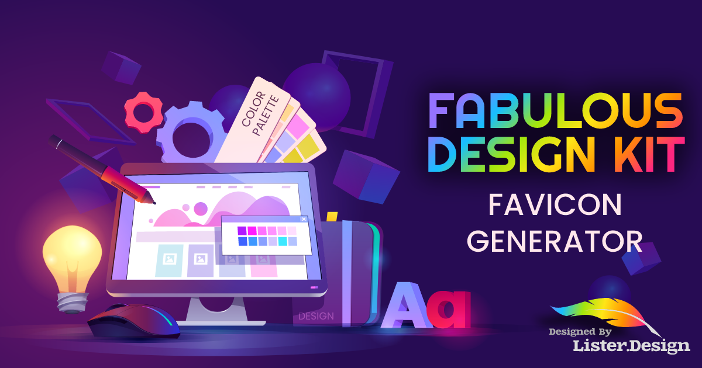

# Fabulous Favicon Generator

The **Fabulous Favicon Generator** is a lightweight Node.js application that simplifies the process of generating favicon files and a webmanifest to meet the requirements of modern browsers.

## Why another favicon generator?

While there are many favicon builders available, most of them generate unnecessary files for modern websites and lack seamless integration into build tools. **The Fabulous Favicon Generator** addresses these issues effectively.

## Getting started

1. Clone the repository or install it globally using npm:
```
npm i fabulous-favicon -g
```
2. Add a square svg icon file named `icon.svg` to your project folder.  You can use a png if you desire, however if you do ensure it is at least 512x512 for good results.
3. Create a favicon.config.json file in your project's root directory with the following content. Be sure to customize it with your project details:

```json
{
	"design": {
		"ios": {
			"pictureAspect": "backgroundAndMargin",
			"backgroundColor": "#ffffff",
			"margin": "14%",
			"assets": {
				"ios6AndPriorIcons": false,
				"ios7AndLaterIcons": false,
				"precomposedIcons": false,
				"declareOnlyDefaultIcon": true
			},
			"appName": "Fabulous Design Kit"
		},
		"desktopBrowser": {
			"design": "raw"
		},
		
		"androidChrome": {
			"pictureAspect": "shadow",
			"themeColor": "#ffffff",
			"manifest": {
				"name": "Fabulous Design Kit",
				"startUrl": "https://lister.design/fabulous-design",
				"display": "standalone",
				"orientation": "notSet",
				"onConflict": "override",
				"declared": true
			},
			"assets": {
				"legacyIcon": false,
				"lowResolutionIcons": false
			}
		}
	},
	"settings": {
		"scalingAlgorithm": "Mitchell"
	}
}
```
3. Run the following command to generate your favicon files:

```node favicon``` 

Alternatively, integrate it into your build tool using the following command options:
```
Options:
  -c, --config <file>       config file (favicon.json) (default:
                            "favicon.config.json")
  -i, --image <image>       image to convert (icon.svg) (default: "icon.svg")
  -o, --output <directory>  output directory (images) (default: "images")
  -b, --base <directory>    base project directory (default: "")
  -h, --help                display help for command
```
## License

This project is licensed under the MIT License - see the [LICENSE](LICENSE)

**The Fabulous Favicon Generator** is licensed with
## Fabulous Design Kit
**The Fabulous Favicon Generator**  is part of T[The Fabulous Design Kit](https://lister.design/fabulous-design), a comprehensive suite of tools designed to assist web designers and developers in easily creating exceptional websites and applications that adhere to industry standards.
